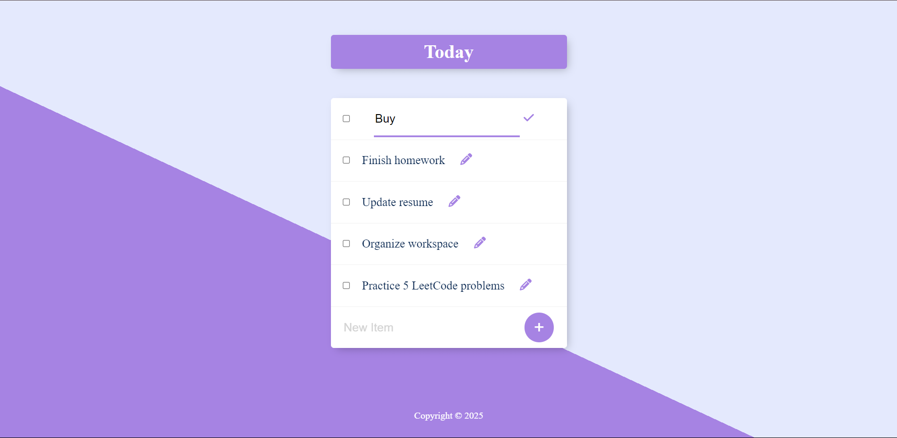

# 📌 Permalist

**Permalist** is a minimalistic full-stack to-do list application built with Node.js, Express, PostgreSQL, and EJS templating. Users can add, edit, and delete tasks — and all data is persisted in a PostgreSQL database.



---

## 🚀 Features

- 📝 Add new to-do items
- ✏️ Edit existing items
- 🗑️ Delete tasks
- 💾 PostgreSQL-backed data persistence
- 🌐 Clean EJS-based frontend
- 🔐 Environment-based configuration using `.env`

---

## 🧰 Technologies Used

- Node.js
- Express.js
- PostgreSQL
- EJS (Embedded JavaScript templates)
- dotenv
- body-parser

---

## 📦 Setup Instructions

### 1. Clone the repository

```bash
git clone https://github.com/your-username/permalist.git
cd permalist
````

### 2. Install dependencies

```bash
npm install
```

### 3. Set up PostgreSQL database

Open your PostgreSQL client (like pgAdmin or psql) and run:

```sql
CREATE DATABASE permalist;

CREATE TABLE items (
  id SERIAL PRIMARY KEY,
  title TEXT
);
```

### 4. Configure environment variables

Create a `.env` file in the root directory and add your PostgreSQL config:

```env
PG_USER=your_postgres_username
PG_HOST=localhost
PG_DATABASE=permalist
PG_PASSWORD=your_postgres_password
PG_PORT=5432
```

---

## ▶️ Running the Project

```
node solution.js
```

Visit: [http://localhost:3000](http://localhost:3000)

---

## 📁 Project Structure

```
/permalist
├── public/
│   └── styles.css (optional)
├── views/
│   └── index.ejs
├── .env
├── solution.js
├── package.json
└── README.md
```
| Operation  | HTTP Method | Route     | Description                                               |
| ---------- | ----------- | --------- | --------------------------------------------------------- |
| **Create** | `POST`      | `/add`    | Adds a new to-do item to the PostgreSQL database          |
| **Read**   | `GET`       | `/`       | Fetches all to-do items and renders them using EJS        |
| **Update** | `POST`      | `/edit`   | Updates the title of an existing to-do item based on `id` |
| **Delete** | `POST`      | `/delete` | Deletes a to-do item from the database using its `id`     |

---

## ✍️ Author

* Goutham Nandula(https://github.com/gouthamnamdula)

---

## 📜 License

This project is licensed under the MIT License.
